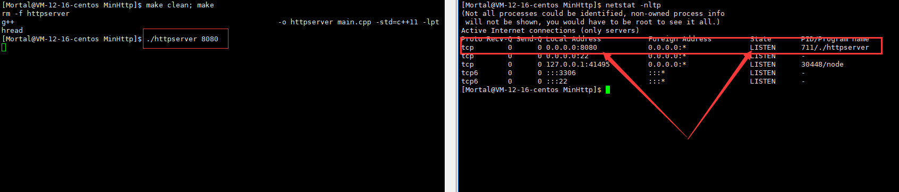
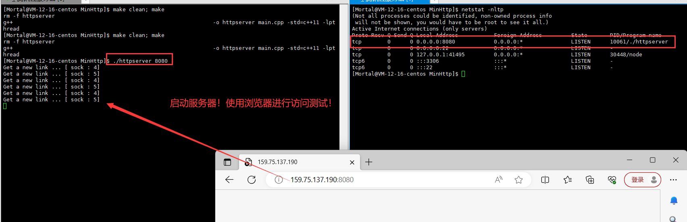
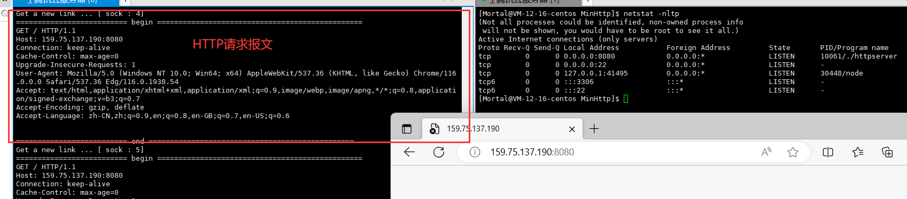
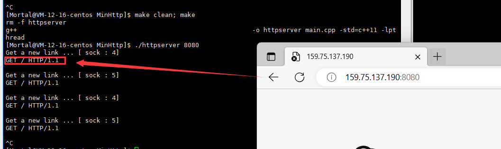

# 轻量级 WebServer  服务器开发流程记录

> 说明：目前主流服务器使用的是http/1.1版本，我们目前按照http/1.0版本来完成（8/23），同时，我们还会对比1.1和1.0的区别。

## 一、HTTP 1.0 的特点及说明

> - 简单快速，HTTP服务器的程序规模小,因而通信速度很快。
> - 灵活，HTTP允许传输任意类型的数据对象，正在传输的类型由 Content-Type 加以标记。
> - **无连接**，每次连接只处理一个请求。服务器处理完客户的请求，并收到客户的应答后，即断开连接（短链接）。采用这种方式可以节省传输时间。（http/1.0具有的功能，http/1.1兼容）
>   - 所谓的无连接是对比 TCP 而言的！HTTP作为应用层协议，使用着下层先有的服务（TCP 完成了连接！），好比是一个 “黑盒复用”！HTTP 不用关心连接，只需要知道使用下层的服务，只需要把数据发出，对方就可以收到！
> - **无状态**，无论是发送方还是接收方都不会去记录对方的状态（登录 / 退出）！

## 二、关于状态记录问题

> **HTTP本身就是为了达到数据传输的功能！**
>
> **HTTP 协议每当有新的请求产生，就会有对应的新响应产生。协议本身并不会保留你之前的一切请求或者响应，这是为了更快的处理大量的事务，确保协议的可伸缩性。**
>
> 对于状态的记录，可以引入 cookie + sessionid 技术来解决！
>
> 简单的理解就是把状态也记录为一条标识性数据发送，在必要时对这个标识进行检测，识别是否持有某些特殊状态来响应特殊的数据！（如：XX视频 VIP 用户）

---

# HTTP 读取请求设计阶段

## 三、URI & URL（格式） & URN

### （一）基本认识

> **URI，是 uniform resource identifier，统一资源标识符，用来唯一的标识一个资源。【设想作用是：标识了资源的唯一存在性！如：身份证号码。】**
>
> **URL，是 uniform resource locator，统一资源定位符，它是一种具体的URI，即 URL 可以用来标识一个资源，而且还指明了如何 获取 这个资源。**
>
> **URN，uniform resource name，统一资源命名，是通过名字来标识资源**，比如：mailto:java-net@java.sun.com。

### （二）浏览器 URL 格式

> HTTP（超文本传输协议）是基于TCP的连接方式进行网络连接
>
> HTTP/1.1版本中给出一种持续连接的机制(长链接，后面会讲)
>
> 绝大多数的Web开发，都是构建在HTTP协议之上的Web应用
>
> ---
>
> HTTP URL（URL 是一种特殊类型的 URI，包含了如何获取指定资源）的格式如下：
>
> ~~~
> http:// + host + [:port][abs_path]
> ~~~
>
> - http：表示要通过 HTTP 协议来定位网络资源
> - host：表示合法的 Internet 主机域名 或 者IP地址（本主机 IP：127.0.0.1）
> - port：指定一个端口号，为空则使用缺省端口：80
> - abs_path：指定请求资源的 URI【 如果 URL 中没有给出 abs_path ，那么当它作为请求 URI 时，必须以 “/” 的形式给出，通常这个工作浏览器自动帮我们完成。】
>
> ---
>
> 注意：如果用户的URL没有指明要访问的某种资源（路径），虽然浏览器会默认添加 "/"，但是依旧没有告诉服务器要访问什么资源！此时，默认返回对应的服务首页！

---

## 四、初步封装  TCP 服务套接字：TcpServer.hpp

> **当前进度：**
>
> - **实现单例化 TCP 服务**
> - **初步封装好：套接字的创建、绑定、监听！**
>
> ---
>
> **细节问题：**
>
> 1. **TCP 链接建立后，当一端连接主动断开时，主动断开的一方四次挥手后会处于 TIME_WAIT 状态！会在一定时间段内占用 socket！会在一定时间段内占用 socket！ 导致无法使用！**
>    - 解决办法：使用 setsockopt() 允许复用！
> 2. **关于本机 IP 的绑定问题！云服务器不能直接绑定公网 IP（ip是特定厂商的虚拟设定）！**
>    - 解决办法：设置为：任意绑定！
>    - local.sin_addr.s_addr = INADDR_ANY;   
> 3. **TCP 服务端创建实现单例化后，整体服务只需要一个实例化对象！**
>    - 对于对象的创建，由于存在多进程、多线程共享代码段的问题，需要加锁保护对象的创建！

~~~c++
#pragma once

#include <iostream>
#include <cstdlib>
#include <cstring>
/* 套接字头文件 */
#include <sys/types.h>
#include <sys/socket.h>
#include <netinet/in.h>
#include <arpa/inet.h>
/* 线程头文件 */
#include <pthread.h>

/* 定义默认端口号：说明：如果采用云服务器，若对外界开放访问，需要在 安全组 中开放端口号！ */
#define PORT 8080
#define BACKLOG 5

/* 单例化设计 */
class TcpServer
{
private:
    static TcpServer* Tcptr;
private:
    TcpServer(const uint16_t port = PORT)
        : _port(port), _listensock(-1)
    {
    }

    TcpServer(const TcpServer &tcpser){}
public:
    static TcpServer* GetInstance(int port){
        // 加锁保护！
        static pthread_mutex_t lock = PTHREAD_MUTEX_INITIALIZER;
        if(nullptr == Tcptr){
            // 无实例对象
            pthread_mutex_lock(&lock);
            if(nullptr == Tcptr){
                // 实例化对象
                Tcptr = new TcpServer(port);
                // 启动服务
                Tcptr->InitServer();
            }
            pthread_mutex_unlock(&lock);
        }
        return Tcptr;
    }

    /* 初始化方法 */
    void InitServer(){
        // 三步走：创建、绑定、监听
        Socket();
        Bind();
        Listen();
    }

    /* 创建套接字 */
    void Socket(){
        _listensock = socket(AF_INET, SOCK_STREAM, 0);
        if(_listensock < 0){
            // 创建套接字失败！
            exit(1);
        }
        // 【注】
        /**
         * TCP 链接建立后，当一端连接主动断开时，主动断开的一方四次挥手后会处于 TIME_WAIT 状态！
         * 会在一定时间段内占用 socket！会在一定时间段内占用 socket！ 导致无法使用
         * 解决方式：设置 允许 复用！
        */
        int opt = 1;
        setsockopt(_listensock, SOL_SOCKET, SO_REUSEADDR, &opt, sizeof(opt));
    }

    /* 绑定套接字 */
    void Bind(){
        struct sockaddr_in local;
        memset(&local, 0, sizeof(local));
        local.sin_family = AF_INET;
        local.sin_port = htons(_port);
        // 云服务器不能直接绑定公网 IP（ip是特定厂商的虚拟设定）！故设置为：任意绑定
        local.sin_addr.s_addr = INADDR_ANY;     
        
        // 绑定
        if(bind(_listensock, (struct sockaddr*)&local, sizeof(local) )< 0){
            exit(2);
        }
        // 到此为止，绑定成功！
    }

    /* 监听套接字 */
    void Listen(){
        // BACKLOG：全连接长度
        if(listen(_listensock, BACKLOG) < 0){
            exit(3);
        }
        // 到此为止，启动监听（处于监听态）！
    }

    ~TcpServer(){}

private:
    /* 不指定 ip ！原因：当前使用的云服务器！ip地址实际是虚拟ip！ */
    /* 关于 ip 的绑定策略：使用随机绑定！ */

    /* 访问的端口号：_port */
    uint16_t _port;

    /*  */
    int _listensock;
};

TcpServer* TcpServer::Tcptr = nullptr;
~~~

---

## 五、初步实现服务端：main.cpp

> **服务端的功能：**
>
> - **获取用户输入的端口号**
> - **启动服务**

~~~c++
#include <iostream>
#include <string>
#include "TcpServer.hpp"

static void Usage(std::string proc){
    std::cout << "Usage =>\t" << proc << " port" << std::endl;
}

int main(int argc, char* argv[]){

    if(argc != 2){
        Usage(argv[0]);
        exit(4);
    }

    uint16_t port = atoi(argv[1]);
    TcpServer* Tcptr = TcpServer::GetInstance(port);

    return 0;
}
~~~

---

## 六、Makefile

~~~makefile
bin=httpserver						#生成的目标文件
cc=g++								#编译选择
LD_FLAGS=-std=c++11 -lpthread		#链接
src=main.cpp

$(bin):$(src)
	$(cc) -o $@ $^ $(LD_FLAGS)

.PHONY:clean
clean:
	rm -f $(bin)
~~~

---

## => 第一阶段搭建测试结果图

> - 使用指定端口号启动
> - 查询状态 => Listen

---

## 七、改进 / 优化  TCP 服务套接字：TcpServer.hpp

> 修改内容：
>
> - 默认端口号的设定移交给上层HTTP进行管理！
>
> 新增：
>
> - 提供 sock 外部获取接口，供 HTTP 层调用 accept 获取链接！

~~~c++
#pragma once

#include <iostream>
#include <cstdlib>
#include <cstring>
/* 套接字头文件 */
#include <sys/types.h>
#include <sys/socket.h>
#include <netinet/in.h>
#include <arpa/inet.h>
/* 线程头文件 */
#include <pthread.h>

/* 定义默认端口号：说明：如果采用云服务器，若对外界开放访问，需要在 安全组 中开放端口号！ */
// #define PORT 8080
#define BACKLOG 5

/* 单例化设计 */
class TcpServer
{
private:
    static TcpServer* Tcptr;
private:
    // 【第一次修改】将端口号的设定放置在 httpServer 层传入
    // 此处不再指定端口号【模拟HTTP协议中的默认设定端口号】
    // TcpServer(const uint16_t port = PORT)
    TcpServer(const uint16_t port)

        : _port(port), _listensock(-1)
    {
    }

    TcpServer(const TcpServer &tcpser){}
public:
    static TcpServer* GetInstance(int port){
        // 加锁保护！
        static pthread_mutex_t lock = PTHREAD_MUTEX_INITIALIZER;
        if(nullptr == Tcptr){
            // 无实例对象
            pthread_mutex_lock(&lock);
            if(nullptr == Tcptr){
                // 实例化对象
                Tcptr = new TcpServer(port);
                // 启动服务
                Tcptr->InitServer();
            }
            pthread_mutex_unlock(&lock);
        }
        return Tcptr;
    }

    /* 初始化方法 */
    void InitServer(){
        // 三步走：创建、绑定、监听
        Socket();
        Bind();
        Listen();
    }

    /* 创建套接字 */
    void Socket(){
        _listensock = socket(AF_INET, SOCK_STREAM, 0);
        if(_listensock < 0){
            // 创建套接字失败！
            exit(1);
        }
        // 【注】
        /**
         * 当一个连接断开时，主动断开的一方会处于 TIME_WAIT 状态！会在一定时间段内占用 socket！
         * 导致无法使用！
         * 解决方式：设置 允许 复用！
        */
        int opt = 1;
        setsockopt(_listensock, SOL_SOCKET, SO_REUSEADDR, &opt, sizeof(opt));
    }

    /* 绑定套接字 */
    void Bind(){
        struct sockaddr_in local;
        memset(&local, 0, sizeof(local));
        local.sin_family = AF_INET;
        local.sin_port = htons(_port);
        // 云服务器不能直接绑定公网 IP（ip是特定厂商的虚拟设定）！故设置为：任意绑定
        local.sin_addr.s_addr = INADDR_ANY;     
        
        // 绑定
        if(bind(_listensock, (struct sockaddr*)&local, sizeof(local) )< 0){
            exit(2);
        }
        // 到此为止，绑定成功！
    }

    /* 监听套接字 */
    void Listen(){
        // BACKLOG：全连接长度
        if(listen(_listensock, BACKLOG) < 0){
            exit(3);
        }
        // 到此为止，启动监听（处于监听态）！
    }

    /* 提供获取套接字结构 */
    int GetSock(){
        return _listensock;
    }

    ~TcpServer(){}

private:
    /* 不指定 ip ！原因：当前使用的云服务器！ip地址实际是虚拟ip！ */
    /* 关于 ip 的绑定策略：使用随机绑定！ */

    /* 访问的端口号：_port */
    uint16_t _port;

    /*  */
    int _listensock;
};

TcpServer* TcpServer::Tcptr = nullptr;
~~~

---

## 八、初步设计HTTP网络服务逻辑

> - 设定默认访问端口号；
> - 初步实现与TCP服务的解耦（由上层HTTP直接使用现成接口实现启动TCP链接+HTTP层初步获取链接逻辑）
> - 初步实现获取网络链接，并将任务交给线程。

~~~c++
#pragma once

#include <iostream>
#include <pthread.h>
#include "TcpServer.hpp"
#include "Protocol.hpp"

/* 设置默认端口号 */
#define PORT 8080

class HttpServer
{
public:
    HttpServer(const uint16_t port = PORT)
        : _port(port),_tcp_server(nullptr),_stop(false)     // _stop 标识默认服务不会停止！
    {
    }

    void InitHttpServer(){
        _tcp_server = TcpServer::GetInstance(_port);
    }

    void Loop(){
        /* 获取套接字 */
        int listensock = _tcp_server->GetSock();
        while(!_stop){
            /* 获取网络链接 */
            struct sockaddr_in peer;
            socklen_t len = sizeof(peer);
            int sock = accept(listensock, (struct sockaddr*)&peer, &len);
            if(sock < 0){
                // 获取失败！
            }
            /* 重新创建一个拷贝的sock，防止在多线程访问下的数据异常 */
            int *_sock = new int(sock);
            /* 创建线程：执行任务 */
            pthread_t tid;
            pthread_create(&tid, nullptr, Entrence::HandlerRequest, (void*)_sock);
            /* 线程分离：实现无需等待！执行完任务后自动释放资源！ */
            pthread_detach(tid);
        }
    }

private:
    /* 端口号 */
    uint16_t _port;
    /* 网络服务实例 */
    TcpServer* _tcp_server;
    /* 服务是否可停止 */
    bool _stop;
};
~~~

---

## 九、初步设计 “服务” 协议：Protocol.hpp

> - 对接HTTP获取连接后分配的线程任务执行（当前仅作前面设计的逻辑检验：输出获取到的sock）

~~~c++
#pragma once

#include <iostream>
#include <unistd.h>

/**
 * 自定义协议 / 任务处理
 */

class Entrence
{
public:
    static void *HandlerRequest(void *_sock)
    {
        int sock = *(int *)_sock;
        delete (int *)_sock;
        std::cout << "Get a new link ... [ sock : " << sock << "]" << std::endl;

        close(sock);
        return nullptr;
    }
};
~~~

---

## => 第二阶段搭建测试结果图

> 本阶段完成的内容：
>
> - TCP服务设计的简单修改（默认端口号的设定移交给上层HTTP进行管理）；
> - 初步设计HTTP应用服务（获取下层链接，并分配任务给线程执行）
> - 初步设计应用服务协议（暂时测试有效性而只获取拿到的sock）
>
> ---
>
> 测试：
>
> - 服务端启动服务后，使用浏览器访问，通过获取的sock来判断程序状态！
>
> ---
>
> 结果：
>
> - 实现了获取网络链接，并分配给线程执行简单输出信息任务！

---

## 十、获取HTTP请求内容：Protocol.hpp

~~~c++
#pragma once

#include <iostream>
#include <unistd.h>
#include <sys/types.h>
#include <sys/socket.h>

/**
 * 自定义协议 / 任务处理
 */

class Entrence
{
public:
    static void *HandlerRequest(void *_sock)
    {
        int sock = *(int *)_sock;
        delete (int *)_sock;
        std::cout << "Get a new link ... [ sock : " << sock << "]" << std::endl;

#ifndef DEBUG
#define DEBUG
        /* 获取请求内容 */
        char buffer[4096];
        std::cout << "========================== begin =================" << std::endl;
        recv(sock, buffer, sizeof(buffer), 0);
        std::cout << buffer << std::endl;
        std::cout << "========================== end ====================" << std::endl;
#endif
        close(sock);
        return nullptr;
    }
};
~~~

## 十一、HTTP 请求与响应（HTTP协议报文格式）

### （一）请求格式

> **请求报文格式：**
>
> **组成：请求行 + 请求报头 + 空行 + 请求正文**
>
> - **请求行（三个内容组成）：[ 请求方法 ] + [ url ] + [ 版本号（请求协议） ] （以 \r\n 结尾）！**
> - - （三部分内容用【空格】间隔）！
> - **请求报头（一般是 6-8 行）【header】：包含本次请求的属性（如：长短链接、客户端信息等）；每行内容格式：[ key：value ]（以 \r\n 结尾）！**
> - **空行：只包含： \r\n** 
> - **请求正文【body】：（可以没有）**

~~~html
<- 第一部分：请求头 -> 
GET / HTTP/1.1
    
<- 第二部分：相关属性 -> 
Host: 159.75.137.190:8080
Connection: keep-alive
Cache-Control: max-age=0
Upgrade-Insecure-Requests: 1
User-Agent: Mozilla/5.0 (Windows NT 10.0; Win64; x64) AppleWebKit/537.36 (KHTML, like Gecko) Chrome/116.0.0.0 Safari/537.36 Edg/116.0.1938.54
Accept: text/html,application/xhtml+xml,application/xml;q=0.9,image/webp,image/apng,*/*;q=0.8,application/signed-exchange;v=b3;q=0.7
Accept-Encoding: gzip, deflate
Accept-Language: zh-CN,zh;q=0.9,en;q=0.8,en-GB;q=0.7,en-US;q=0.6
    
<- 第三部分：相关属性 -> 
~~~

#### 问题

> **GET / HTTP/1.1：/ 是不是linux服务器的根目录开始呢?**
>
> - 不一定，通常不会设置成为根目录，我们通常由 http 服务器设置为自己的 WEB 根目录（就是Linux下一个特定的路径）

### （二）响应报文格式

> **响应报文格式：**
>
> **组成：状态行 + 响应报头 + 空行 + 响应正文**
>
> - **请求行（三个内容组成）：[ 版本号（请求协议） ]  + [ 状态码（如：404） ] + [ 状态描述信息 ] + （以 \r\n 结尾）！**
> - - （三部分内容用【空格】间隔）！
> - **请求报头（一般是 6-8 行）【header】：每行内容格式：[ key：value ]（以 \r\n 结尾）！**
> - **空行：只包含： \r\n** 
> - **响应正文【body】：如：视频、音频、htm、图片 ...**

---

## 十二、HTTP 报文成分的解析：Util.hpp

### （一）实现报文信息的单行读取

> 注意：HTTP报文中，除了正文部分之外，所有内容的都是行存储形式！
>
> 因此解析时，可以通过行读取的方式来获取信息！
>
> 但是注意：不能直接使用C/C++行读取的方式来获取，因为不同平台格式中，换行符可能不同（存在如：\r\n、\r、\n 等），因此行读取必须自定义实现！

~~~c++
#pragma once

#include <iostream>
#include <string>
#include <sys/types.h>
#include <sys/socket.h>

// 工具类
class Util
{
public:
    /* 对报头信息按行读取 */
    /**
     * 参数：
     *  std::string &out：输出型参数，向外返回解析出来的内容
     */
    static int ReadInLine(int sock, std::string &out)
    {

        // 对报文进行按行读取，设计方法兼容各种换行风格
        char ch = 'X';
        while (ch != '\n')
        {
            // 按字节方式读取
            ssize_t s = recv(sock, &ch, 1, 0);
            if (s > 0)
            {
                // 读到数据
                if (ch == '\r')
                {
                    // 处理按 '\r' or '\r\n' 作为换行符的情况，
                    // 操作我们需要对 \r 后的内容进行判断
                    /*
                         一般情况下，recv 是读取并取走缓冲区中的数据
                         对于：'\r\n'，是正常情况
                         对于：'\r' 就造成了数据读取走而丢失有效数据情况
                         解决方式：recv 的 MSG_PEEK 模式参数（窥探：只读不取走数据）
                    */
                    recv(sock, &ch, 1, MSG_PEEK);
                    if (ch == '\n')
                    {
                        // 说明：换行符是 '\r\n'
                        recv(sock, &ch, 1, 0);
                    }
                    else
                    {
                        // 说明：换行符是 '\r'
                        ch = '\n';
                    }
                }
                // 到此：只有 \n or 普通字符
                out.push_back(ch);
            }
            else if (s == 0)
            {
                // 读到结尾
                return 0;
            }
            else
            {
                // 读取错误
                return -1;
            }
        }
        return out.size();
    }
};
~~~

#### 单行读取效果：

---

## 十三、构建请求和响应