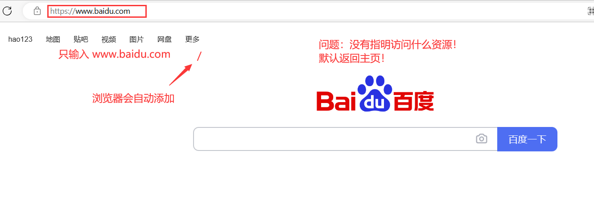

# 轻量级 WebServer  服务器开发流程说明

> 说明：目前主流服务器使用的是http/1.1版本，我们目前按照http/1.0版本来完成（8/23），同时，我们还会对比1.1和1.0的区别。

## 一、HTTP 1.0 的特点及说明

> - 简单快速，HTTP服务器的程序规模小,因而通信速度很快。
> - 灵活，HTTP允许传输任意类型的数据对象，正在传输的类型由 Content-Type 加以标记。
> - **无连接**，每次连接只处理一个请求。服务器处理完客户的请求，并收到客户的应答后，即断开连接（短链接）。采用这种方式可以节省传输时间。（http/1.0具有的功能，http/1.1兼容）
>   - 所谓的无连接是对比 TCP 而言的！HTTP作为应用层协议，使用着下层先有的服务（TCP 完成了连接！），好比是一个 “黑盒复用”！HTTP 不用关心连接，只需要知道使用下层的服务，只需要把数据发出，对方就可以收到！
> - **无状态**，无论是发送方还是接收方都不会去记录对方的状态（登录 / 退出）！

## 二、关于状态记录问题

> **HTTP本身就是为了达到数据传输的功能！**
>
> **HTTP 协议每当有新的请求产生，就会有对应的新响应产生。协议本身并不会保留你之前的一切请求或者响应，这是为了更快的处理大量的事务，确保协议的可伸缩性。**
>
> 对于状态的记录，可以引入 cookie + sessionid 技术来解决！
>
> 简单的理解就是把状态也记录为一条标识性数据发送，在必要时对这个标识进行检测，识别是否持有某些特殊状态来响应特殊的数据！（如：XX视频 VIP 用户）

---

## 三、URI & URL（格式） & URN

### （一）基本认识

> **URI，是 uniform resource identifier，统一资源标识符，用来唯一的标识一个资源。【设想作用是：标识了资源的唯一存在性！如：身份证号码。】**
>
> **URL，是 uniform resource locator，统一资源定位符，它是一种具体的URI，即 URL 可以用来标识一个资源，而且还指明了如何 获取 这个资源。**
>
> **URN，uniform resource name，统一资源命名，是通过名字来标识资源**，比如：mailto:java-net@java.sun.com。

### （二）浏览器 URL 格式

> HTTP（超文本传输协议）是基于TCP的连接方式进行网络连接
>
> HTTP/1.1版本中给出一种持续连接的机制(长链接，后面会讲)
>
> 绝大多数的Web开发，都是构建在HTTP协议之上的Web应用
>
> ---
>
> HTTP URL（URL 是一种特殊类型的 URI，包含了如何获取指定资源）的格式如下：
>
> ~~~
> http:// + host + [:port][abs_path]
> ~~~
>
> - http：表示要通过 HTTP 协议来定位网络资源
> - host：表示合法的 Internet 主机域名 或 者IP地址（本主机 IP：127.0.0.1）
> - port：指定一个端口号，为空则使用缺省端口：80
> - abs_path：指定请求资源的 URI【 如果 URL 中没有给出 abs_path ，那么当它作为请求 URI 时，必须以 “/” 的形式给出，通常这个工作浏览器自动帮我们完成。】
>
> ---
>
> 注意：如果用户的URL没有指明要访问的某种资源（路径），虽然浏览器会默认添加 "/"，但是依旧没有告诉服务器要访问什么资源！此时，默认返回对应的服务首页！

---

## 四、初步封装  TCP 服务套接字：TcpServer.hpp

> **当前进度：**
>
> - **实现单例化 TCP 服务**
> - **初步封装好：套接字的创建、绑定、监听！**
>
> ---
>
> **细节问题：**
>
> 1. **TCP 链接建立后，当一端连接主动断开时，主动断开的一方四次挥手后会处于 TIME_WAIT 状态！会在一定时间段内占用 socket！会在一定时间段内占用 socket！ 导致无法使用！**
>    - 解决办法：使用 setsockopt() 允许复用！
> 2. **关于本机 IP 的绑定问题！云服务器不能直接绑定公网 IP（ip是特定厂商的虚拟设定）！**
>    - 解决办法：设置为：任意绑定！
>    - local.sin_addr.s_addr = INADDR_ANY;   
> 3. **TCP 服务端创建实现单例化后，整体服务只需要一个实例化对象！**
>    - 对于对象的创建，由于存在多进程、多线程共享代码段的问题，需要加锁保护对象的创建！

~~~c++
#pragma once

#include <iostream>
#include <cstdlib>
#include <cstring>
/* 套接字头文件 */
#include <sys/types.h>
#include <sys/socket.h>
#include <netinet/in.h>
#include <arpa/inet.h>
/* 线程头文件 */
#include <pthread.h>

/* 定义默认端口号：说明：如果采用云服务器，若对外界开放访问，需要在 安全组 中开放端口号！ */
#define PORT 8080
#define BACKLOG 5

/* 单例化设计 */
class TcpServer
{
private:
    static TcpServer* Tcptr;
private:
    TcpServer(const uint16_t port = PORT)
        : _port(port), _listensock(-1)
    {
    }
    TcpServer(const TcpServer &tcpser){}
public:
    static TcpServer* GetInstance(int port){
        // 加锁保护！
        static pthread_mutex_t lock = PTHREAD_MUTEX_INITIALIZER;
        if(nullptr == Tcptr){
            // 无实例对象
            pthread_mutex_lock(&lock);
            if(nullptr == Tcptr){
                // 实例化对象
                Tcptr = new TcpServer(port);
                // 启动服务
                Tcptr->InitServer();
            }
            pthread_mutex_unlock(&lock);
        }
        return Tcptr;
    }

    /* 初始化方法 */
    void InitServer(){
        // 三步走：创建、绑定、监听
        Socket();
        Bind();
        Listen();
    }

    /* 创建套接字 */
    void Socket(){
        _listensock = socket(AF_INET, SOCK_STREAM, 0);
        if(_listensock < 0){
            // 创建套接字失败！
            exit(1);
        }
        // 【注】
        /**
         * TCP 链接建立后，当一端连接主动断开时，主动断开的一方四次挥手后会处于 TIME_WAIT 状态！
         * 会在一定时间段内占用 socket！ 导致无法使用！
         * 解决方式：设置 允许 复用！
        */
        int opt = 1;
        setsockopt(_listensock, SOL_SOCKET, SO_REUSEADDR, &opt, sizeof(opt));
    }

    /* 绑定套接字 */
    void Bind(){
        struct sockaddr_in local;
        memset(&local, 0, sizeof(local));
        local.sin_family = AF_INET;
        local.sin_port = htons(_port);
        // 云服务器不能直接绑定公网 IP（ip是特定厂商的虚拟设定）！故设置为：任意绑定
        local.sin_addr.s_addr = INADDR_ANY;     
        
        // 绑定
        if(bind(_listensock, (struct sockaddr*)&local, sizeof(local) < 0)){
            exit(2);
        }
        // 到此为止，绑定成功！
    }

    /* 监听套接字 */
    void Listen(){
        // BACKLOG：全连接长度
        if(listen(_listensock, BACKLOG) < 0){
            exit(3);
        }
        // 到此为止，启动监听（处于监听态）！
    }

    ~TcpServer(){}

private:
    /* 不指定 ip ！原因：当前使用的云服务器！ip地址实际是虚拟ip！ */
    /* 关于 ip 的绑定策略：使用随机绑定！ */

    /* 访问的端口号：_port */
    uint16_t _port;

    /* 套接字 */
    int _listensock;
};

TcpServer* TcpServer::Tcptr = nullptr;
~~~

---

## 五、初步实现服务端：main.cpp

> **服务端的功能：**
>
> - **获取用户输入的端口号**
> - **启动服务**

~~~c++
#include <iostream>
#include <string>
#include "TcpServer.hpp"

static void Usage(std::string proc){
    std::cout << "Usage =>\t" << proc << " port" << std::endl;
}

int main(int argc, char* argv[]){

    if(argc != 2){
        Usage(argv[0]);
        exit(4);
    }

    uint16_t port = atoi(argv[1]);
    TcpServer* Tcptr = TcpServer::GetInstance(port);

    return 0;
}
~~~

---

## 六、Makefile

~~~makefile
bin=httpserver						#生成的目标文件
cc=g++								#编译选择
LD_FLAGS=-std=c++11 -lpthread		#链接
src=main.cpp

$(bin):$(src)
	$(cc) -o $@ $^ $(LD_FLAGS)

.PHONY:clean
clean:
	rm -f $(bin)
~~~

## 、HTTP 请求与响应（HTTP协议报文格式）